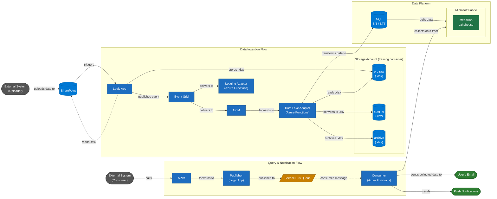

# Azure Integration Architecture

## Overview

This architecture covers two integration flows built on Azure services:

1. **Data Ingestion Flow** — An external system uploads files to SharePoint, which triggers an automated pipeline that processes and stores data in Microsoft Fabric via Logic Apps, Event Grid, APIM, and Azure Functions.
2. **Query & Notification Flow** — An external system queries data via APIM, which routes requests through a Service Bus Queue to an Azure Function that retrieves results from Microsoft Fabric and delivers them via email and push notifications.

---

## Architecture Diagram



> **Dashed arrows** (`-.->`) indicate pull-based or asynchronous interactions.
> **Solid arrows** (`-->`) indicate synchronous push or trigger-based interactions.

---

## Component Reference

| Component | Azure Service | Role |
|-----------|--------------|------|
| SharePoint | Microsoft 365 | Landing zone for `.xlsx` files uploaded by external systems |
| Logic App *(Trigger)* | Azure Logic Apps | Triggered by SharePoint upload; reads `.xlsx` content via SP connector, writes it to `training/pre-raw/`, then publishes event to Event Grid |
| Storage Account — pre-raw | Azure Storage | Receives the raw `.xlsx` from the Logic App; source for the Data Lake Adapter |
| Storage Account — staging | Azure Storage | Holds converted `.csv` files (timestamped) produced by the Data Lake Adapter |
| Storage Account — archive | Azure Storage | Long-term store for the original `.xlsx` files (timestamped) after processing |
| Event Grid | Azure Event Grid | Decouples event producers from consumers; enables parallel delivery |
| APIM *(Ingestion)* | Azure API Management | Governs and routes events from Event Grid to the Data Lake Adapter |
| Data Lake Adapter | Azure Functions | Downloads `.xlsx` from `pre-raw`, converts to timestamped `.csv` in `staging`, archives original `.xlsx` to `archive`. Returns stub `200 OK` if `BlobStorage__AccountUrl` is not configured |
| Logging Adapter | Azure Functions | Captures all ingestion events for audit and observability |
| SQL (SIT/STT) | Azure SQL Database | Structured intermediate staging tables (source-to-intermediate / source-to-target) |
| Microsoft Fabric — Medallion | Microsoft Fabric | Lakehouse with Bronze / Silver / Gold layers; source of truth for analytics |
| APIM *(Query)* | Azure API Management | Single governed entry point for external consumer requests |
| Publisher | Azure Logic Apps | Accepts API requests and enqueues them on the Service Bus |
| Service Bus Queue | Azure Service Bus | Reliable async queue; decouples API response from data retrieval |
| Consumer | Azure Functions | Dequeues requests, queries Fabric, and dispatches results to output channels |
| User's Email | — | Notification channel for query results |
| Push Notifications | — | Mobile / web real-time notification channel |

---

## Flow Details

### Flow 1 — Data Ingestion

```
External System
  ──uploads .xlsx──► SharePoint
                         │ triggers (every 3 min)
                         ▼
                     Logic App
                         │ reads .xlsx content (SP connector)
                         ▼
                   training/pre-raw/{filename}.xlsx
                         │ publishes event (blobContainer + blobName)
                         ▼
                     Event Grid
                     ┌───┴────────────────────────────┐
                     │ delivers to                    │ delivers to
                     ▼                                ▼
                   APIM                      Logging Adapter
                     │ forwards to           (audit trail)
                     ▼
             Data Lake Adapter
               │ downloads .xlsx from pre-raw
               │ converts .xlsx → .csv (ExcelDataReader)
               ├──► training/staging/{filename}_{timestamp}.csv
               ├──► training/archive/{filename}_{timestamp}.xlsx
               │ deletes from pre-raw
               │ transforms data to (Phase 2)
               ▼
             SQL (SIT/STT)
               │ pulls data
               ▼
         Microsoft Fabric (Medallion)
```

**Key design points:**

- SharePoint is the sole entry point; external systems require no direct access to the processing pipeline.
- The Logic App reads the `.xlsx` from SharePoint and writes it to `training/pre-raw/` before publishing to Event Grid — the event carries blob coordinates (`blobContainer`, `blobName`), not file content.
- The Data Lake Adapter converts `.xlsx` → `.csv` using ExcelDataReader, writes the CSV (with timestamp suffix) to `staging/`, archives the original (with timestamp suffix) to `archive/`, then deletes from `pre-raw/`. This completes the three-folder lifecycle within the single `training` container.
- The delete from `pre-raw` is non-fatal — if it fails, the CSV and archive are already committed and only manual cleanup is needed.
- Event Grid provides **fan-out**: the same event simultaneously drives the data pipeline *and* the logging adapter.
- The DataLakeAdapter uses Managed Identity (`BlobStorage__AccountUrl` must be set; returns stub `200 OK` otherwise). SQL write is deferred to Phase 2.
- Data lands in **SQL staging tables** (SIT/STT) before being promoted into the Fabric Medallion lakehouse, allowing validation and transformation before analytics consumption.

---

### Flow 2 — Query & Notification

```
External System
  ──calls──► APIM
                │ forwards to
                ▼
           Publisher (Logic App)
                │ publishes to
                ▼
         Service Bus Queue
                │ consumes message (async)
                ▼
          Consumer (Azure Functions)
            │ collects data from Microsoft Fabric
            ├──► User's Email
            └──► Push Notifications
```

**Key design points:**

- APIM is the **single governed entry point**, enforcing authentication, rate limiting, and routing for all consumer requests.
- The Service Bus Queue **decouples** the synchronous API response from the potentially slow data retrieval, making the API call non-blocking.
- The Consumer aggregates results from Microsoft Fabric and delivers them through two independent channels: email and push notifications.

---

## Design Considerations

| Concern | Approach |
|---------|----------|
| **Decoupling** | Event Grid and Service Bus isolate every stage; components scale and fail independently |
| **Observability** | Dedicated Logging Adapter captures all ingestion events for audit trail and troubleshooting |
| **API governance** | Both external-facing entry points route through APIM for consistent auth, throttling, and versioning |
| **File lifecycle** | Three-folder pattern (`pre-raw` → `staging` + `archive`) within one container provides clear separation of raw, processed, and historical data |
| **Data quality** | SQL SIT/STT staging layer allows validation and transformation before data reaches the Medallion lakehouse |
| **Delivery guarantees** | Service Bus Queue provides at-least-once delivery with dead-letter queue support for failed messages |
| **Scalability** | Azure Functions scale on demand; Event Grid and Service Bus handle traffic spikes without capacity planning |
